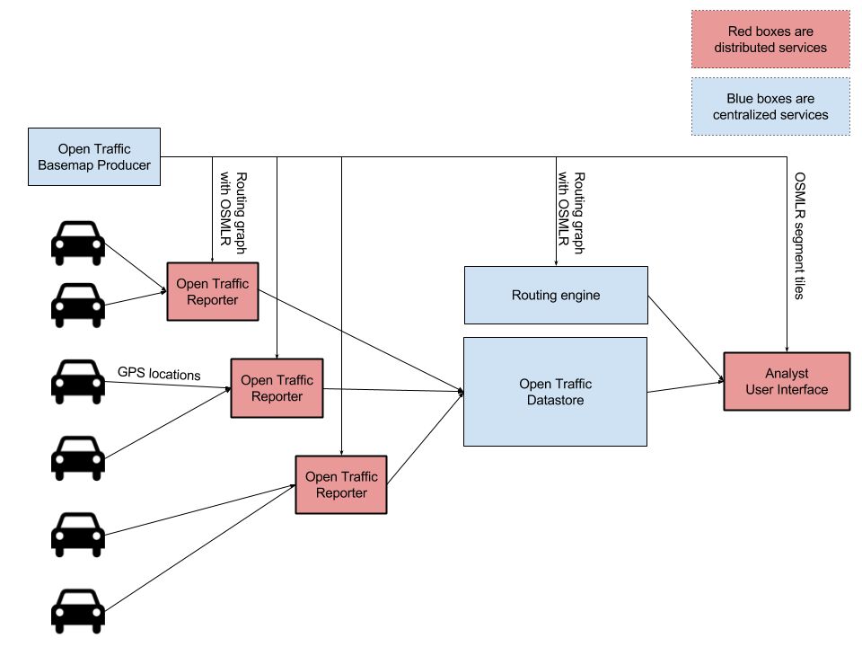
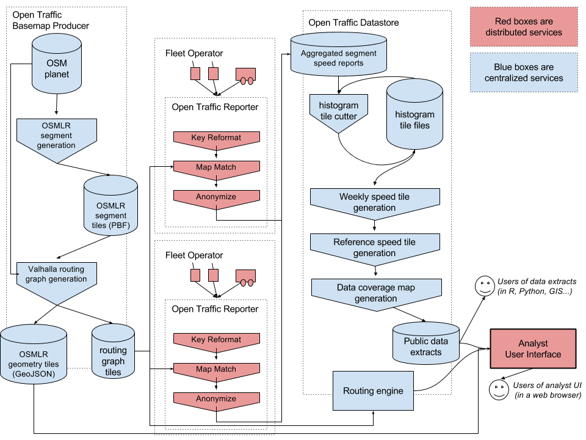

# Open Traffic v2 platform

## Contents

<!-- the following is generated by:
     1. npm install --save markdown-toc -g
     2. markdown-toc -i README.md
-->

<!-- toc -->

- [Introduction](#introduction)
- [Platform architecture](#platform-architecture)
  * [Overview diagram and description of components](#overview-diagram-and-description-of-components)
  * [More detailed component diagram](#more-detailed-component-diagram)
- [System components](#system-components)
  * [Basemap Generator](#basemap-generator)
    + [OSMLR](#osmlr)
    + [Valhalla routing graph tiles with OSMLR segment associations](#valhalla-routing-graph-tiles-with-osmlr-segment-associations)
  * [Reporter](#reporter)
  * [Datastore](#datastore)
  * [Data Privacy and Competitive Concerns](#data-privacy-and-competitive-concerns)
  * [Analyst User Interface](#analyst-user-interface)
  * [Routing engine](#routing-engine)
  * [Stand-alone traffic maps](#stand-alone-traffic-maps)

<!-- tocstop -->

## Introduction

Open Traffic is a global data platform to process anonymous positions of vehicles and smartphones into real-time and historical traffic statistics. We're building this in the open, using fully open-source software, with involvement from a growing list of partners.

After a successful proof-of-concept by the World Bank, Grab, and Conveyal (known as OTv1), Mapzen is working with the partners to build out a new version of the platform that will scale to have global coverage (known as OTv2). For more information on the partnerships behind Open Traffic and the OTv2 platform, see:

- [The World Bank Launches New Open Transport Partnership to Improve Transportation through Open Data](http://www.worldbank.org/en/news/press-release/2016/12/19/the-world-bank-launches-new-open-transport-partnership-to-improve-transportation-through-open-data) press release from the World Bank
- [Open Traffic Data to Revolutionize Transport](http://www.worldbank.org/en/news/feature/2016/12/19/open-traffic-data-to-revolutionize-transport) story from the World Bank
- [_World Bank + Mapzen + partners = open traffic data_](https://mapzen.com/blog/announcing-open-traffic/) on the Mapzen blog 

The following diagrams and documentation describe OTv2. For more information on OTv1, see the [opentraffic/architecture](https://github.com/opentraffic/architecture) repository.

## Platform architecture
### Overview diagram and description of components

The OTv2 platform is built of both distributed and centralized services:

<!-- To view and edit the original diagram: https://docs.google.com/drawings/d/12B5inmN1jrfIjJ2BQLnVJl3uW_g30OGr7DFiwA9nQTM/edit -->

From left to right the components in this diagram are:

1. **Open Traffic Basemap Producer** is a centralized service. On a regular basis, it ingests OpenStreetMap data and outputs the OSMLR segments against which traffic statistics are matched, reported, stored, and displayed.
2. **Open Traffic Reporter** is run by each organization that contributes probe data to Open Traffic. Each Reporter instance ingests GPS location streams, map-matches those locations against OSMLR segments, aggregates these locations into anonymous speed statistics.
3. **Open Traffic Datastore** receives and merges together the anonymous speed statistics from all of the Reporter instances. Datastore creates a variety of public data extracts from its historical records of traffic statistics, including space/time tile files to power the Analyst User Interface and routing graph tile files to power a traffic-influenced routing engine.
4. An instance of [Valhalla](https://github.com/valhalla), an open-source routing engine by Mapzen, serves as a **routing engine**.
5. **Open Traffic Analyst User Interface** serves as an easy-to-use view into Open Traffic's historical speed and observation count data, allowing basic querying by area, time, and route.

### More detailed component diagram

The same as above, with more detail on the specific pieces within each component and the data flows between components:

<!-- To view and edit the original diagram: https://docs.google.com/drawings/d/17KOkCOvnq7WyUmsnmHoaQjarUO4eLqBFv7TIq0QY9ac/edit -->

## System components

### Basemap Generator

The Basemap Generator is a set of centralized processes that regularly create the road network data common to all other OTv2 components.

#### OSMLR

On a regular basis (likely quarter), the Basemap Generator runs the [OSMLR application](https://github.com/opentraffic/osmlr) to create traffic segments according to the [OSMLR tile spec](https://github.com/opentraffic/osmlr-tile-spec). Outputs are in protocol buffer and GeoJSON formats. The resulting worldwide OSMLR tile set is available for free use by all.

→ See [this blog post](https://mapzen.com/blog/open-traffic-osmlr-technical-preview) and [this blog post](https://mapzen.com/blog/osmlr-2nd-technical-preview/) for an introduction to OSMLR.

→ To download OSMLR segment tiles, go to [these S3 bucket listings](https://s3.amazonaws.com/osmlr-tiles/listing.html).

#### Valhalla routing graph tiles with OSMLR segment associations

On a regularly basis (weekly), the Basemap Generator combines OpenStreetMap data with OSMLR segments to create a set of Valhalla routing graph tiles. These routing graph tiles are available to power Valhalla for map-matching purposes, as is done inside the Open Traffic Reporter.

### Reporter

(In OTv1, this component was called the [Traffic Engine](https://github.com/opentraffic/traffic-engine).)

Reporter is run by each organization that is providing probe data to the Open Traffic platform. Reporter is distributed as a set of Docker containers, or can be run anywhere Java, Python, and [Apache Kafka](https://kafka.apache.org/) are available.

Reporter performs the following steps:

1. Reformat incoming GPS-derived points to match the expected key names and structure
2. Collect points into a moving window. That is, a time-ordered slice of a single vehicle's positions.
3. Match the trajectory of points in the window to OSMLR segments, using the map-matching utilities provided by [Valhalla Meili](https://github.com/valhalla/valhalla/blob/master/docs/meili.md) and the Valhalla routing graph tiles created by the Basemap Producer
4. Pools matches to ensure they pass privacy thresholds
5. When privacy thresholds are met, send resulting binned times and observation counts to the centralized Open Traffic Datastore

→ See more documentation in [the Reporter repository](https://github.com/opentraffic/reporter).

→ The nature of map-matching and generating traffic statistics is probabilistic; noisy GPS input can produce variable results . See the [Reporter Quality Testing Rig](https://github.com/opentraffic/reporter-quality-testing-rig) for more information on how to evaluate and tune a Reporter deployment. Also described in a series of blog posts: [one](https://mapzen.com/blog/map-matching-validation/), [two](https://mapzen.com/blog/data-driven-map-matching/), [three](https://mapzen.com/blog/map-matching-post-processing/), [four](https://mapzen.com/blog/map-matching-built-env/).

### Datastore

(In OTv1, this component was called the Data Pool. Its API was called the [Traffic Engine App](https://github.com/opentraffic/traffic-engine-app).)

The [Datastore](https://github.com/opentraffic/datastore) ingests input from distributed [Reporter](https://github.com/opentraffic/reporter) instances. It stores the aggregated statistics as ***histogram tile files***.

From the histogram tile files, Datastore produces a variety of public data extracts:

- historical average speed tiles (`.spd` tiles) → [documentation](https://github.com/opentraffic/datastore/blob/master/public_data_extracts.md#historical-average-speed-tiles)
- intersection delay and queue length tiles (`.nex` tiles) → [documentation](https://github.com/opentraffic/datastore/blob/master/public_data_extracts.md#intersection-delays-and-queue-lengths)
- reference speed tiles (`.ref` tiles) → [documentation](https://github.com/opentraffic/datastore/blob/master/public_data_extracts.md#reference-speed-tiles)
- coverage maps → [documentation](https://github.com/opentraffic/datastore/blob/master/coverage_map.md)

→ See more documentation in [the Datastore repository](https://github.com/opentraffic/datastore).

### Data Privacy and Competitive Concerns

Note that the Datastore does not store any personally identifiable information. The contents of the histogram tile files have been aggregated such that it should not be possible to reconstruct the paths of any individuals.

The histogram tile files include the number of vehicles/drivers observed along each OSMLR segment. This volume information is important for weighting averages and other statistics. However, releasing to the public the exact number of vehicles/drivers along specific roads may reveal too much information about the business operations of Open Traffic's data providers. Therefore, public data extracts produced by the Datastore only include vheicle/driver counts as a binned "prevalence" index.

### Analyst User Interface

(In OTv1, this component was the [Traffic Engine App](https://github.com/opentraffic/traffic-engine-app).)

The Analyst UI provides a simple way of performing basic exploration and querying of OTv2 data. It is powered by the Datastore's public data extracts, just by downloading tile files from AWS S3.

→ See more documentation in [the Analyst UI repository](https://github.com/opentraffic/analyst-ui).

### Routing engine

Analyst UI uses the [Valhalla routing engine](https://github.com/valhalla) to plan journeys between origins and one or more destinations. Analyst UI then uses the Datastore's public data extracts to calculate the ETA along these routes. 

In the future, Valhalla may also offer journey-planning that is weighted by historical and/or real-time speeds.

→ See [this documentation](https://mapzen.com/documentation/mobility/turn-by-turn/api-reference/) for more information on Valhalla's routing API.

→ See [this documentation](https://mapzen.com/documentation/mobility/map-matching/api-reference/#trace-attributes-action) for more information on Valhalla's `trace_attributes` action, which is also used by Analyst UI.

→ See [this blog post](https://mapzen.com/blog/speed-tiles/) for a proof-of-concept using traffic speeds to influence Valhalla routing.

### Stand-alone traffic maps

Datastore's public data extracts can be turned into traffic maps for display. While not formally part of the OTv2 platform, we are demonstrating future possibilities during the development process:

→ See [this demo](https://mapzen.github.io/open-traffic-poc-data-demo/) using the Tangram map rendering library to display an entire day's worth of traffic in Manila (from the OTv1 platform). Here is an animated screenshot of some of the map:

